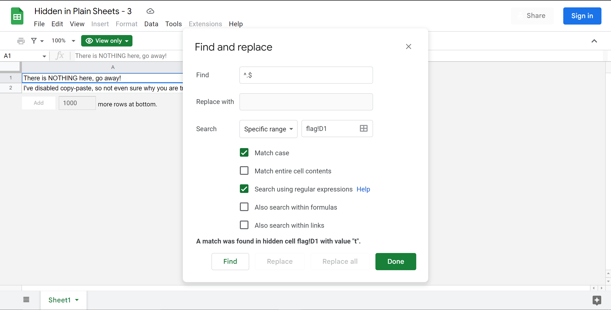

### **Title:** rev/universal

**Hint:** Observe find and replace

**Solution:**\
Flag is present in the hidden sheet named flag and is split into a char in each cell from A1 to AR1.\
So, to get the flag we can use the below regex expression on each cell to get the each char of the flag.
  

**Flag:** `lactf{H1dd3n_&_prOt3cT3D_5h33T5_Ar3_n31th3r}`
