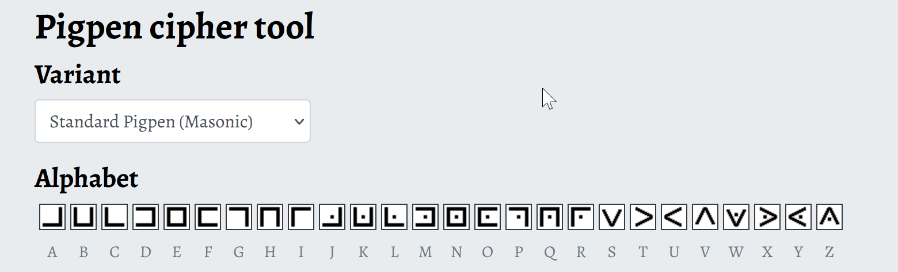

### **Title:** crypto/rolling in the mud

**Hint:** pigpen cipher

**Solution:**\
From the picture and title with description we can find the image uses pigpen cipher.  

It's a straight forward pigpen cipher where we can plug the chars as accordingly
to determine the flag.  

Note: Image needs to be oriented properly based on how the flag would look like.

**Flag:** `lactf{rolling_and_rolling_and_rolling_until_the_pigs_go_home}`
