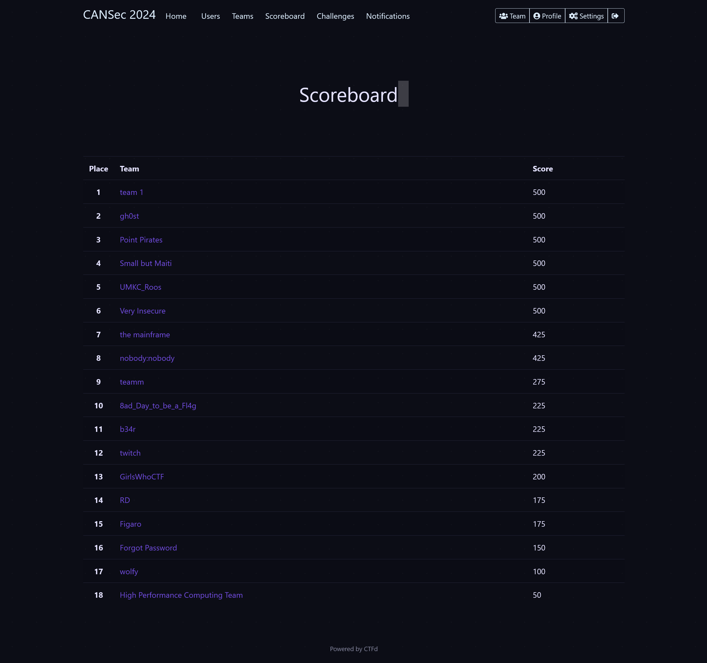

# CANSec 2024 CTF Writeups

A list of all challenges from the CANSec 2024 CTF:

### Beginner Challenges
- [Cipher 1 Decode the Hidden Message](./beginner/Cipher_1_Decode_the_Hidden_Message)
- [Feline Secrets](./beginner/Feline_Secrets)
- [Hidden Admin](./beginner/Hidden_Admin)
- [Binary 1 Decode the Compiled Binary](./beginner/Binary_1_Decode_the_Compiled_Binary)
- [Crack the Password](./beginner/Crack_the_Password)
- [Network 1 Packet Hunt](./beginner/Network_1_Packet_Hunt)

### Intermediate Challenges
- [Chilled Clue](./intermediate/Chilled_Clue)
- [Network 2](./intermediate/Network_2)
- [Cipher 2](./intermediate/Cipher_2)
- [Binary 2](./intermediate/Binary_2)

### Advanced Challenges
- [Network 3](./advanced/Network_3)
- [Cipher 3](./advanced/Cipher_3)
- [Binary 3](./advanced/Binary_3)
- [Penguin Code](./advanced/Penguin_Code)

# Results
We were able to solve 11/14 challenges, apart from the APK reverse engineering and two Steganography challenges but for which solutions are discussed in here.

**Rank:**  2

**Prize:** Nintendo Switch Lite

## Scoreboard

