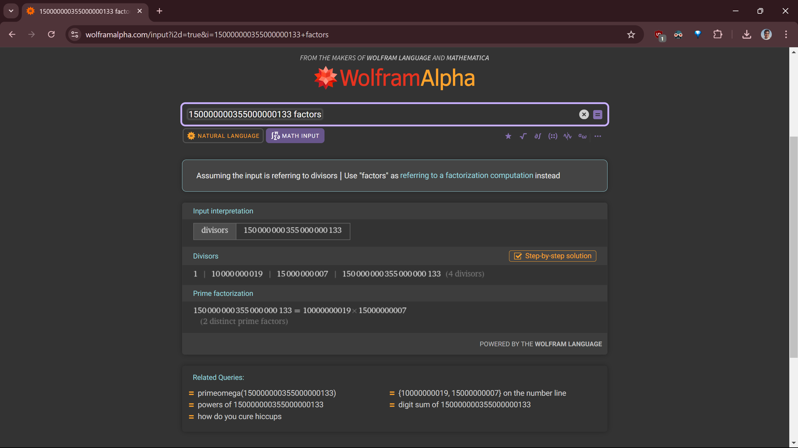
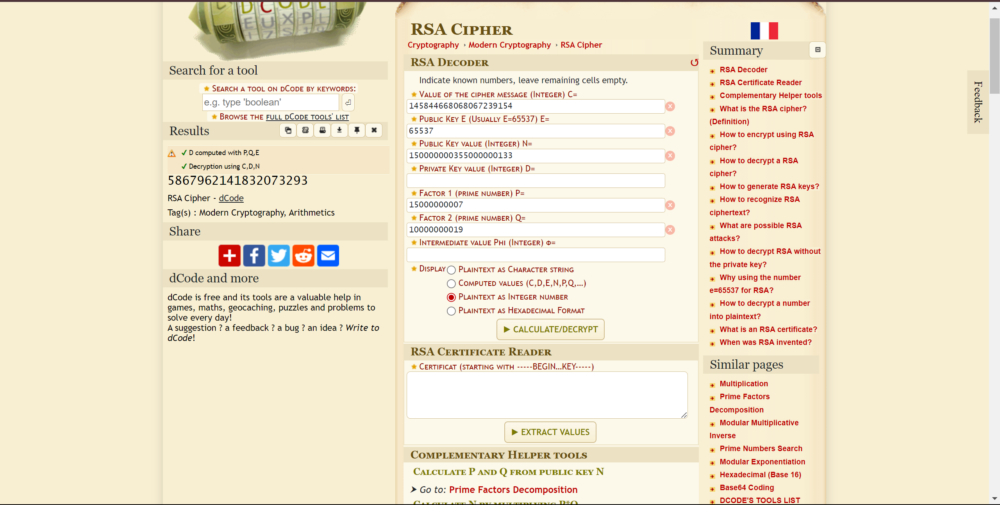

# Cipher 3: Decode the RSA Cipher
**Points**: 75

## Description
You've been provided with a ciphertext that has been encrypted using RSA. The ciphertext is as follows: 145844668068067239154. Your task is to decrypt this ciphertext to reveal the flag. You will need to use the public key (n, e): (150000000355000000133, 65537) and apply your knowledge of RSA decryption. Your goal is to decrypt the ciphertext and submit the flag (the flag is case sensitive). Can you uncover the hidden message?

## Writeup
So, here we were given with.
```python
ciphertext = 145844668068067239154
n = 150000000355000000133
e = 65537
```

If we can factorize n, we can simply decode the cipher text. For finding the factors, I have used WolframAlpha and the output from it is as below.



```python
150000000355000000133 = 10000000019 * 15000000007 # (2 distinct prime factors)
p = 10000000019
q = 15000000007
```

Now, I have used dcode.fr for RSA for the decryption and the result is as below.



# Flag
5867962141832073293
