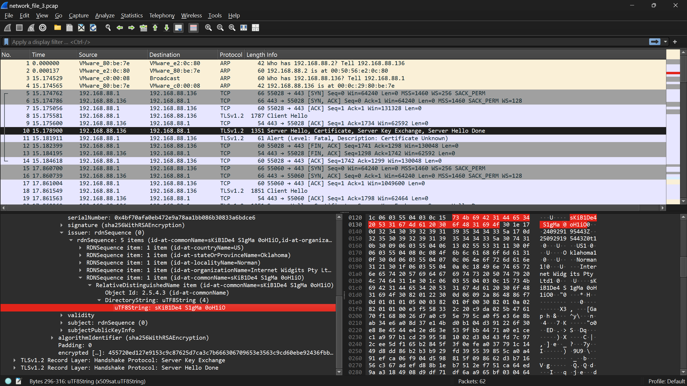

# Network 3: Packet Hunt
**Points**: 75

## Description
We've intercepted a network capture file `network_file_3.pcap`, and it’s up to you to find the hidden flag. Somewhere in the traffic, among all the noise of typical web activity, is your target. Use a network analysis tool to dig through the packets and uncover the flag. The challenge isn’t just spotting the flag—it’s figuring out where it’s been hidden in plain sight.

## Writeup
For this one also, I have used strings and immediately found the flag.
```
$ strings network_file_3.pcap | grep -i ctf  # Nothing
$ strings network_file_3.pcap
http/1.1
W^rh
EL `]
...
Oklahoma1
Norman1!0
Internet Widgits Pty Ltd1
sKiB1De4 S1gMa 0oH1iO0
240929195443Z
250929195443Z0t1
Oklahoma1
Norman1!0
Internet Widgits Pty Ltd1
sKiB1De4 S1gMa 0oH1iO0
X3,
[Gap
...
```

Even better strings which sorts by length using awk and restricts it by length.
```
$ strings network_file_3.pcap | awk 'length($0) >= 8 && length($0) <= 35 { print length, $0 }' | sort -nr | cut -d' ' -f2- | uniq
Internet Widgits Pty Ltd1
sKiB1De4 S1gMa 0oH1iO0
250929195443Z0t1
240929195443Z
^MBw.Y}) rB
FmY"h"U2hc8
Oklahoma1
Norman1!0
D--d~   D/l
{+5J>bcVZ
>OG\5?Nq
http/1.1
0qm?eB?;
```

## Solution 2
Lets see the pcap file using Wireshark. After looking at packets one-by-one (as the #packets is small) we can find the flag being present in TLS certificate which we can observe below.



# Flag
sKiB1De4 S1gMa 0oH1iO0
