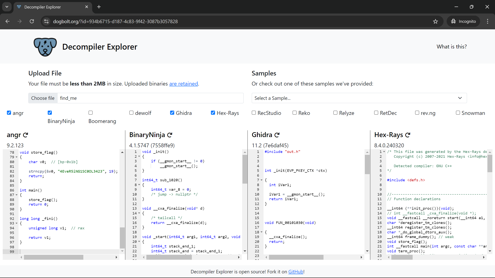

# Binary 1: Decode the Compiled Binary
**Points**: 25

## Description
You've been provided with a binary file named find\_me, which is the output of a C program compiled using gcc. Your task is to analyze the binary file and uncover the hidden flag. Use your knowledge to extract the flag from the compiled output. Once you find the hidden message, submit the flag. Can you reveal the flag?

## Writeup
Given a binary, use file to identify the type of binary.
```
$ file find_me
find_me: ELF 64-bit LSB pie executable, x86-64, version 1 (SYSV), dynamically linked, interpreter /lib64/ld-linux-x86-64.so.2, BuildID[sha1]=c76ee30130f6884541bc7dc543ab0f8fad97236c, for GNU/Linux 3.2.0, not stripped
```

As it is Linux binary, lets try to debug using gdb by identifying functions present and then looking for interesting ones.
```
$ gdb ./find_me
(gdb) info functions
All defined functions:

Non-debugging symbols:
0x0000000000001000  _init
0x0000000000001030  __cxa_finalize@plt
0x0000000000001040  _start
0x0000000000001070  deregister_tm_clones
0x00000000000010a0  register_tm_clones
0x00000000000010e0  __do_global_dtors_aux
0x0000000000001120  frame_dummy
0x0000000000001129  store_flag
0x0000000000001180  main
0x0000000000001194  _fini
```

Here, we can see 2 interesting functions main & store\_flag and lets disassemble them.
```
(gdb) disassemble main
Dump of assembler code for function main:                                                                                                                                            0x0000000000001180 <+0>:     endbr64
   0x0000000000001184 <+4>:     push   rbp
   0x0000000000001185 <+5>:     mov    rbp,rsp
   0x0000000000001188 <+8>:     call   0x1129 <store_flag>
   0x000000000000118d <+13>:    mov    eax,0x0
   0x0000000000001192 <+18>:    pop    rbp
   0x0000000000001193 <+19>:    ret
   End of assembler dump.
(gdb) disassemble store_flag
Dump of assembler code for function store_flag:
   0x0000000000001129 <+0>:     endbr64
   0x000000000000112d <+4>:     push   rbp
   0x000000000000112e <+5>:     mov    rbp,rsp
   0x0000000000001131 <+8>:     mov    BYTE PTR [rbp-0x13],0x34
   0x0000000000001135 <+12>:    mov    BYTE PTR [rbp-0x12],0x45
   0x0000000000001139 <+16>:    mov    BYTE PTR [rbp-0x11],0x76
   0x000000000000113d <+20>:    mov    BYTE PTR [rbp-0x10],0x65
   0x0000000000001141 <+24>:    mov    BYTE PTR [rbp-0xf],0x52
   0x0000000000001145 <+28>:    mov    BYTE PTR [rbp-0xe],0x35
   0x0000000000001149 <+32>:    mov    BYTE PTR [rbp-0xd],0x69
   0x000000000000114d <+36>:    mov    BYTE PTR [rbp-0xc],0x4e
   0x0000000000001151 <+40>:    mov    BYTE PTR [rbp-0xb],0x47
   0x0000000000001155 <+44>:    mov    BYTE PTR [rbp-0xa],0x31
   0x0000000000001159 <+48>:    mov    BYTE PTR [rbp-0x9],0x53
   0x000000000000115d <+52>:    mov    BYTE PTR [rbp-0x8],0x43
   0x0000000000001161 <+56>:    mov    BYTE PTR [rbp-0x7],0x30
   0x0000000000001165 <+60>:    mov    BYTE PTR [rbp-0x6],0x4f
   0x0000000000001169 <+64>:    mov    BYTE PTR [rbp-0x5],0x4c
   0x000000000000116d <+68>:    mov    BYTE PTR [rbp-0x4],0x33
   0x0000000000001171 <+72>:    mov    BYTE PTR [rbp-0x3],0x34
   0x0000000000001175 <+76>:    mov    BYTE PTR [rbp-0x2],0x32
   0x0000000000001179 <+80>:    mov    BYTE PTR [rbp-0x1],0x33
   0x000000000000117d <+84>:    nop
   0x000000000000117e <+85>:    pop    rbp
   0x000000000000117f <+86>:    ret
End of assembler dump.
```

 We can observe store\_flag is called in main and copies some data in byte-by-byte order into rbp. Also, it could be a string and as it is being copied in reverse, we use `sb` to print it properly.
```
(gdb) b *store_flag+84
Breakpoint 1 at 0x117d
(gdb) r
Starting program: find_me
[Thread debugging using libthread_db enabled]
Using host libthread_db library "/lib/x86_64-linux-gnu/libthread_db.so.1".

Breakpoint 1, 0x000055555555517d in store_flag ()
(gdb) x/sb $rbp-0x13
0x7fffffffe77d: "4EveR5iNG1SC0OL3423\240\347\377\377\377\177"
```
## Solution 2:
By simply throwing this binary inside decompilers would make it even much more easier. Decompiler Explorer (https://dogbolt.org/) actually helps with this.



# Flag
4EveR5iNG1SC0OL3423
