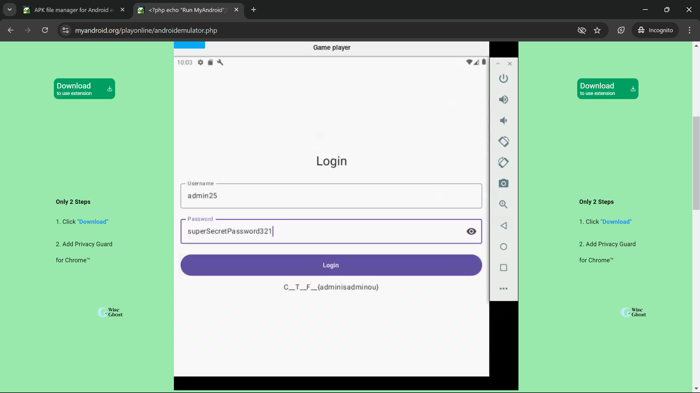

# Hidden Admin
**Points**: 25

## Description
In this challenge, you will encounter an APK file containing a simple login page. Hidden deep within the app is the CTF flag, but it's not so easy to find! The app requires reverse engineering and a bit of creativity to crack the logic and retrieve the flag. You will need to examine the APK, figure out the encoding and decoding mechanisms, and identify the correct credentials to access the hidden flag. Who is the real Admin?

Hint: Watch out for misleading fake admin users and encoded credentials. Not everything is as it seems!

## Writeup
This is a completely different challenge but most things are same, so I employed using a Java decompiler named jadx for the job.

GitHub: https://github.com/skylot/jadx

Followed the instructions for setting it up,
```
$ curl -LO https://github.com/skylot/jadx/archive/refs/tags/v1.5.0.tar.gz
$ gzip -d v1.5.0.tar.gz
$ tar -xvf v1.5.0.tar
$ cd jadx-1.5.0/
$ ./gradlew dist # >JDK 11 required.
$ ls -la ./build/jadx/bin/jadx
```

Now, lets use jadx cli to decompile the apk to its source contents.
```
$ ./build/jadx/bin/jadx -d output ctf_app.apk
```

It produces a sources and resources directories in the output/ folder. But looking at different folders, we can immediately find that `com/CANSECCTF/loginview` has the main application logic. As the application is written in Kotlin (Guess, since android apk), the file of our interest in MainActivityKt.java. After looking into the contents we can immediately find a decodeCTF() function which uses base64 to decode a string which is actually our flag which we can also confirm by finding the correct admin user in the list of hard-coded users and using it to login into the application.
```java
public static final List<User> generateUsers() {
    ArrayList arrayList = new ArrayList();
    arrayList.add(new User("user1", encodePassword("superSecretPassword321"), false, false, 8, null));
    arrayList.add(new User("user2", encodePassword("superSecretPassword321"), false, false, 8, null));
    ...
    arrayList.add(new User("user10", encodePassword("superSecretPassword321"), false, false, 8, null));
    arrayList.add(new User("admin1", encodePassword("superSecretPassword321"), true, false));
    ...
    arrayList.add(new User("admin25", encodePassword("superSecretPassword321"), true, true));
    arrayList.add(new User("admin26", encodePassword("superSecretPassword321"), true, false));
    ...
    arrayList.add(new User("admin31", encodePassword("superSecretPassword321"), true, false));
    return arrayList;
}

public static final String decodeCTF() {
    byte[] decode = Base64.getDecoder().decode("YWRtaW5pc2FkbWlub3U");
    Intrinsics.checkNotNullExpressionValue(decode, "decode(...)");
    return "C__T__F__{" + new String(decode, Charsets.UTF_8) + '}';
}
```

By actually understanding the User class and its constructor or by just simply picking the odd-1-out we can find the admin25 is the real admin. If we use his credentials we can get the flag as below. (Also, I have used a online android emulator to run the app - https://www.myandroid.org/)



Using base64 decoding to get the flag.
```
$ printf "YWRtaW5pc2FkbWlub3U" | base64 -d | xxd
base64: invalid input
00000000: 6164 6d69 6e69 7361 646d 696e 6f75       adminisadminou
```

Note:
* We can also use `https://www.decompiler.com/` to decompile the apk online as well.

# Flag
adminisadminou
