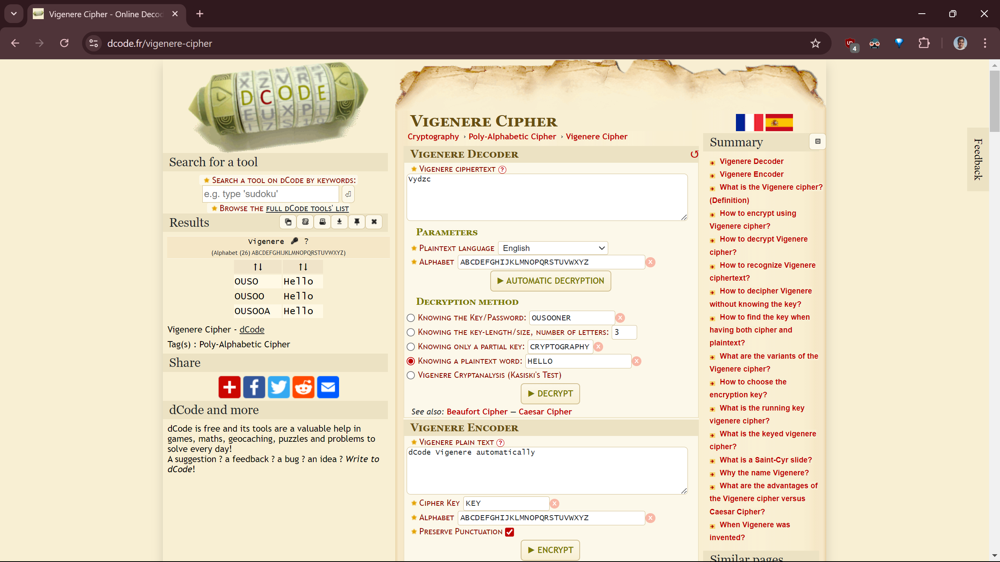
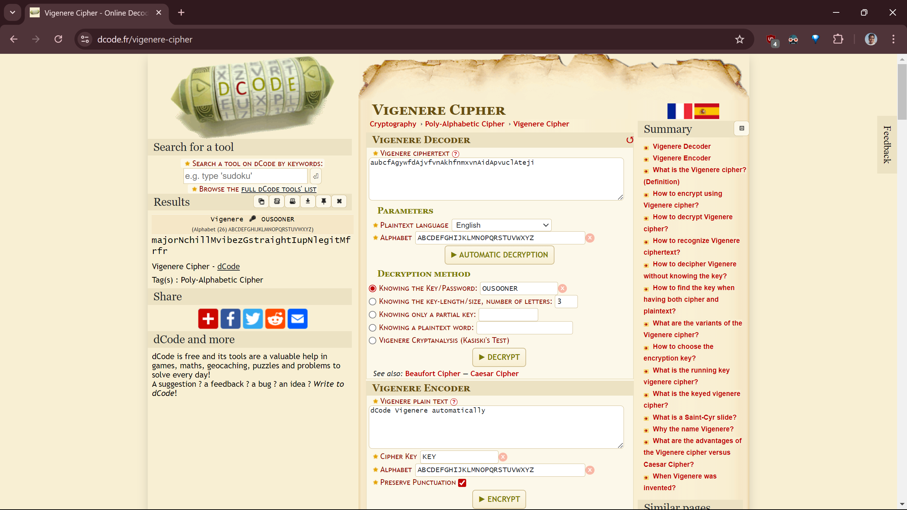

# Cipher 2: Decode the Hidden Message
**Points**: 50

## Description
You've been provided with a file named decode\_cipher\_2.txt containing 10 examples of plaintext and ciphertext. Your goal is to identify the encryption pattern and decrypt the final ciphertext to reveal the flag. The ciphertext for the flag is located at the end of the file and is as follows: aubcf gywfd jvfvn khfnmxvn id pvucl teji. To aid in the decryption, you might need to use the keyword "OUSooner." Your task is to decrypt this ciphertext and submit the flag in all lowercase. Include the spaces in your answer as well. Can you uncover the hidden message?

## Writeup
Given a file containing both plain texts and cipher texts.
```
Plaintext: Hello
Ciphertext: Vydzc
```

By looking at the first one we can see it is not a ROT cipher as plaintext letters l gave different cipher letters and also a keyword **OUSooner** was given to us. My guess was then it could be Vigenere Cipher.

So, I jumped onto the www.dcode.fr website and tested the same.



Also, the caveat was dcode.fr vigenere cipher implementation omits the spaces and decrypts/encrypts using the keyword multiple times but here when a space character is present the keyword letter was being omitted. So, in order for us to use the website to decrypt our data we can just fill spaces with chars and convert them baack to spaces after decryption.



```
aubcf gywfd jvfvn khfnmxvn id pvucl teji
aubcfAgywfdAjvfvnAkhfnmxvnAidApvuclAteji
majorNchillMvibezGstraightIupNlegitMfrfr
major chill vibez straight up legit frfr
```

# Flag
major chill vibez straight up legit frfr
