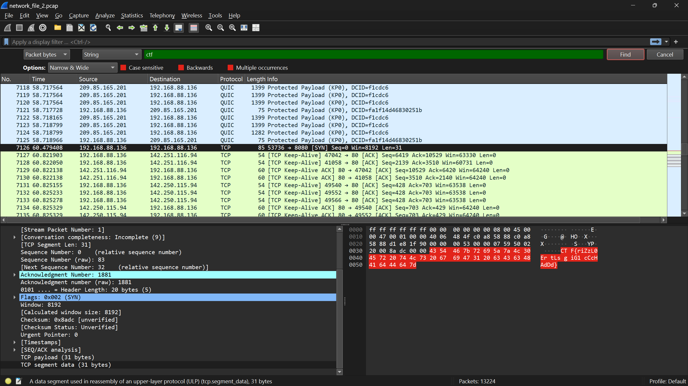

# Network 2: Packet Hunt
**Points**: 50

## Description
We've intercepted a network capture file network\_file\_2.pcap, and it’s up to you to find the hidden flag. Somewhere in the traffic, among all the noise of typical web activity, is your target. Use a network analysis tool to dig through the packets and uncover the flag. The challenge isn’t just spotting the flag—it’s figuring out where it’s been hidden in plain sight.

## Writeup
For this, I actually used simple strings command with grep to find the flag. As we have already seen flag structure in network 1 challenge, to my surprise it immediately gave the flag.
```
$ strings network_file_2.pcap | grep -i ctf
ctf"&
/qcTF
CTF{riZzL0Er tLs giG1 cCcHAdDd}
<li><a href="ctf/">ctf/</a></li>
<li><a href="ctf/">ctf/</a></li>
<li><a href="ctf/">ctf/</a></li>
<li><a href="ctf/">ctf/</a></li>
...
```

## Solution 2
As, it is a pcap file lets fire-up our wireshark to analyze it. Actually this flag is hidden in TCP segment data which we can observe below,
```
Wireshark filters: nothing
Wireshark String Search: ctf in packet bytes and case insensitive.
```



# Flag
riZzL0Er tLs giG1 cCcHAdDd
